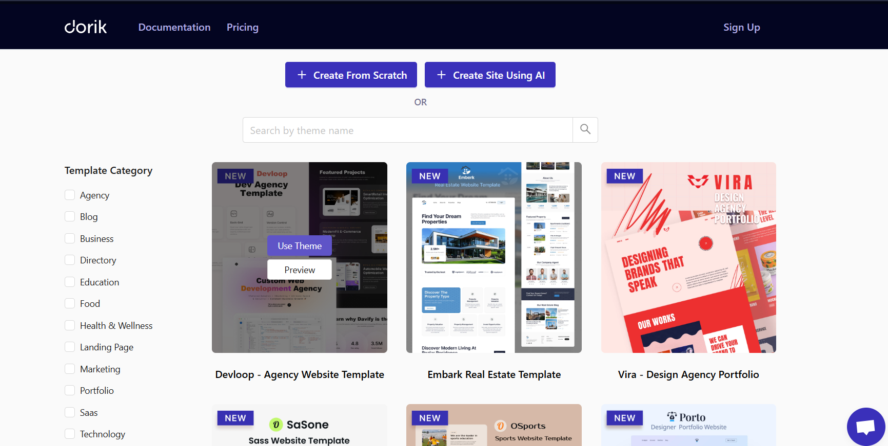

Otel Website Builder | Hızlı & Otomatik Web Sitesi Oluşturucu

 Amaç:
Otel sahiplerinin teknik bilgiye ihtiyaç duymadan, hazır şablonlar ve formlar aracılığıyla kendi web sitelerini hızlı ve otomatik olarak oluşturabilmesini sağlamak. İstenilen temada istenilen özelleştirmeleri yapabilme imkanı sağlayarak kişisel bir deneyim sunmak.

 Hedef Kullanıcılar:
. Otel sahipleri ve küçük işletmeler
. Teknik bilgisi olmayan kişiler
. Tek sayfalık, modern ve sade web sitesi isteyen kullanıcılar

 Kullanılacak Teknolojiler:
- Frontend: `Next.js` 
- Backend: `.NET Core` 
- Veritabanı: `SQL Server` 
- Dağıtım: `Docker`

 Temel Özellikler:
. Hazır otel temalarından seçim
. Formla başlık, açıklama, galeri, iletişim bilgisi girme
. JSON yapısından HTML + CSS üretme
. Sayfanın anlık önizlemesi
. “İndir” butonuyla .zip dosya olarak dışa aktarma
. (İsteğe bağlı) Sürükle-bırak editör

 Rakipler:
- **Carrd** → sade ama sektöre özel değil

- **Dorik** → güçlü ama genel kullanım

- **Elektraweb** → otellere özel ama builder değil

- **Webflow** → güçlü ama pahalı ve karmaşık

 Proje Farkı:
- Otel sektörü özelinde tema ve içerik desteği
- JSON ile özelleştirme + statik HTML üretimi
- Teknik bilgi gerektirmeyen UX
- Dosya indirme özelliği (offline barındırma da mümkün)

--------------------------

WebSnap Nedir?

Website ve Snap kelimelerinin birleşiminden oluşmuştur. Sloganımızdan da anlaşılacağı üzere: Parmak izi kadar **eşsiz**, parmak şıklatmak kadar **kolay**.

**WebSnap**, otel sahiplerinin teknik bilgiye ihtiyaç duymadan hızlı ve profesyonel bir otel web sitesi oluşturmasını sağlayan modern bir platformdur.  

Sloganımızın tamamı: **Create your website in a snap, as unique as your fingerprint.**

-  Dakikalar içinde kurulum  
-  Otellere özel şablonlar ve özellikler  
-  Kodlama bilgisi gerektirmez  
-  Mobil uyumlu ve modern kullanıcı arayüzü  
-  SEO dostu ve çok dilli destek

