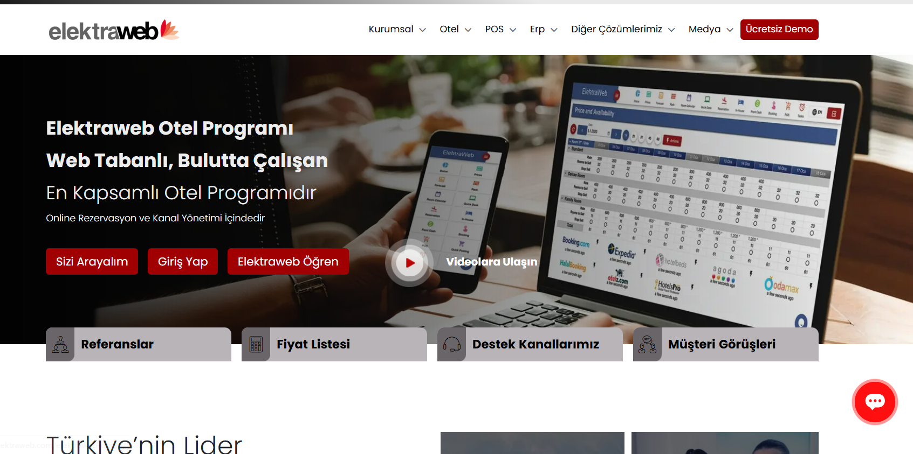

Otel Website Builder | Hızlı & Otomatik Web Sitesi Oluşturucu

 Amaç:
Otel sahiplerinin teknik bilgiye ihtiyaç duymadan, hazır şablonlar ve formlar aracılığıyla kendi web sitelerini hızlı ve otomatik olarak oluşturabilmesini sağlamak. İstenilen temada istenilen özelleştirmeleri yapabilme imkanı sağlayarak kişisel bir deneyim sunmak.

 Hedef Kullanıcılar:
. Otel sahipleri ve küçük işletmeler
. Teknik bilgisi olmayan kişiler
. Tek sayfalık, modern ve sade web sitesi isteyen kullanıcılar

 Kullanılacak Teknolojiler:
. Next.js → Frontend & SSR destekli kullanıcı arayüzü
. Node.js → JSON verisinden dinamik HTML üretimi, dosya oluşturma
. Tailwind CSS → Şablonların stil tasarımı
. JSON → Sayfa yapısı verisi

 Temel Özellikler:
. Hazır otel temalarından seçim
. Formla başlık, açıklama, galeri, iletişim bilgisi girme
. JSON yapısından HTML + CSS üretme
. Sayfanın anlık önizlemesi
. “İndir” butonuyla .zip dosya olarak dışa aktarma
. (İsteğe bağlı) Sürükle-bırak editör

 Rakipler:
- **Carrd** → sade ama sektöre özel değil

- **Dorik** → güçlü ama genel kullanım

- **Elektraweb** → otellere özel ama builder değil

- **Webflow** → güçlü ama pahalı ve karmaşık

 Proje Farkı:
- Otel sektörü özelinde tema ve içerik desteği
- JSON ile özelleştirme + statik HTML üretimi
- Teknik bilgi gerektirmeyen UX
- Dosya indirme özelliği (offline barındırma da mümkün)

